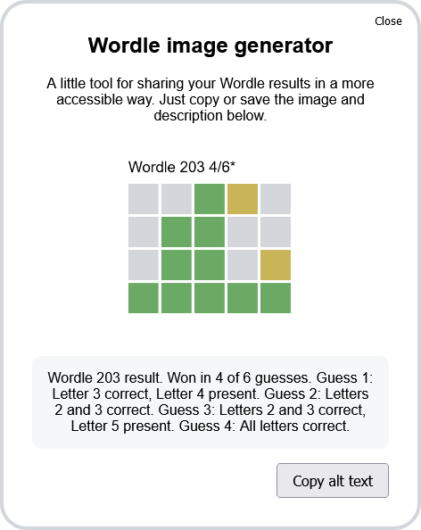

# Wordle Result Image Generator
A bookmarklet which generates an image and alt text for sharing your Wordle results, which is hopefully a tad less painful for people using screen readers than a horde of emoji squares 😉

## Usage
Simply save a new bookmark in your web browser and set the URL to the contents of [bookmarklet.txt](./bookmarklet.txt).

When you've finished a Wordle and want to share your results, click the bookmark while the game is open and a pop-up will appear with an image and alt text for you to copy.

The image is padded with white space so that it's in a 16:9 aspect ratio to try and make sure that Twitter displays it in a somewhat reasonable format.

## Browser support
All major desktop browsers and most mobile browsers support bookmarklets. One browser I know does _not_ support them is Firefox on Android (yay web development!)